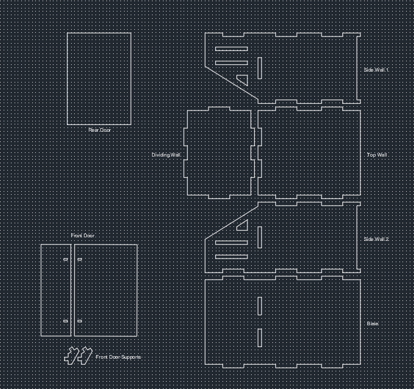
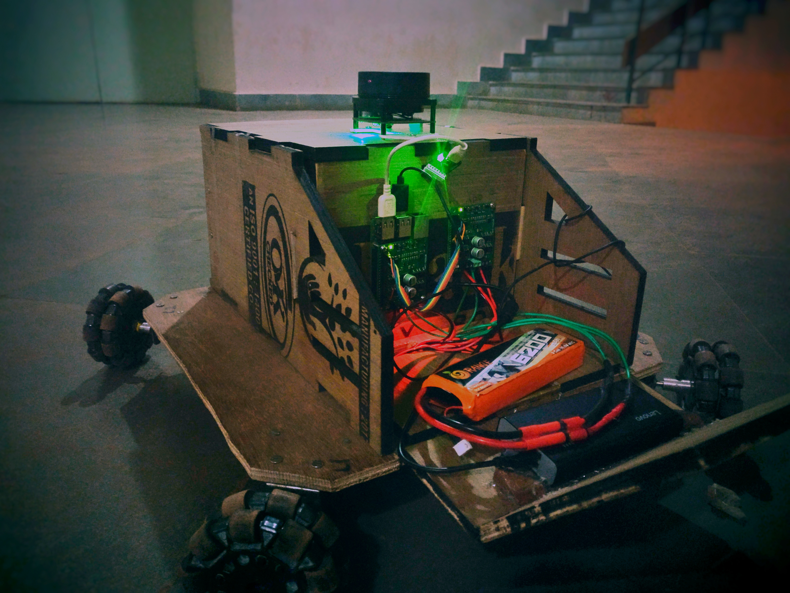

### Description:

 
The attached files contain the designs that one might require to make his own DIY omnibase. It is designed on AutoCAD 2017, and then converted to DXF format to be cut using the laser cutter. 

The design files included are suitable for 1cm thick wood or acrylic sheets, but it can be easily modified for thinner sheets. All the different parts are properly labelled in the design file (body.dwg), and it is quite self-explanatory for assembly. 

Image of AutoCAD file body.dwg with the designs to be laser cut.

Image of omnibase after it is entirely assembled.
